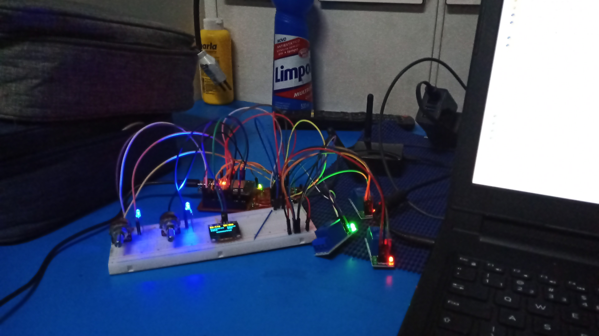
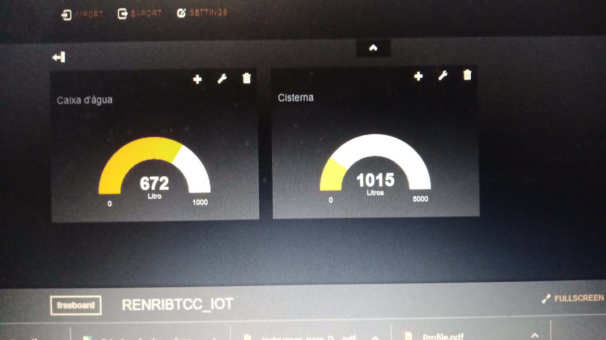
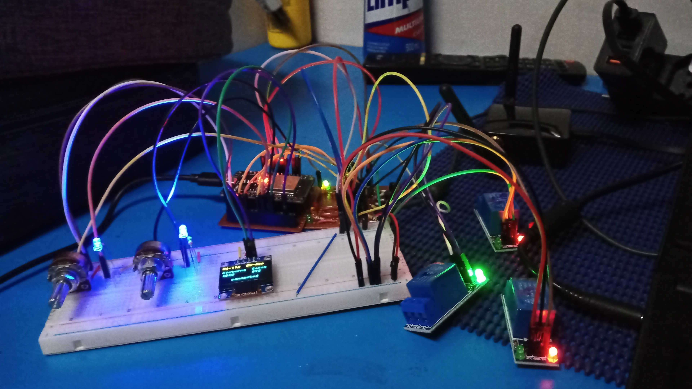
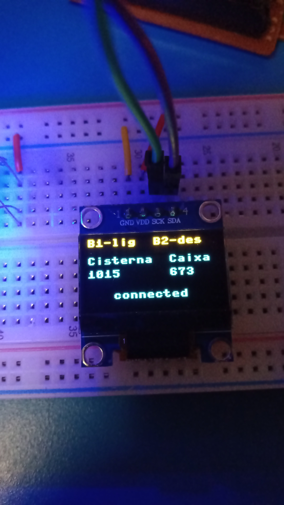
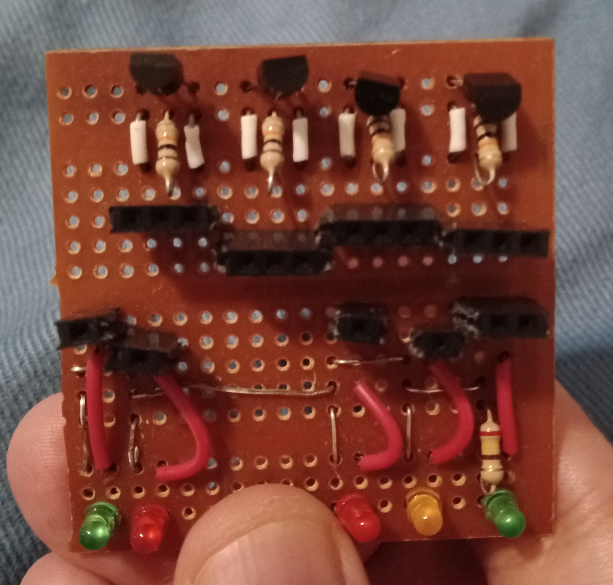
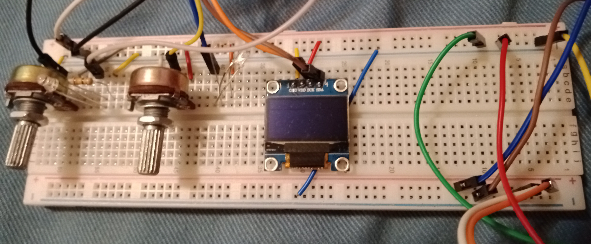

# ESP32 IoT Water Level Monitor & Pump Controller

Embedded IoT system developed as a **Computer Engineering final project (TCC)**. Monitors cistern and water tank levels in real time and automates pump control based on configurable thresholds — with cloud monitoring and a local OLED display.

Built entirely with MicroPython on an ESP32, from circuit design and hand-soldered PCB to cloud dashboard integration.

---

## Features

- **Dual-channel level monitoring** — cistern and water tank, via analog sensors (ADC)
- **Automatic pump control** with hysteresis logic to prevent rapid switching
- **Three-level status indication** per channel — red / yellow / green LEDs
- **Local OLED display** (SSD1306, I2C) showing pump status, levels, and WiFi state in real time
- **WiFi connectivity** with JSON-based credential management
- **Cloud data push** via HTTP POST to [dweet.io](https://dweet.io) every 15 seconds
- **Real-time dashboard** on [Freeboard.io](https://freeboard.io) with gauge meters for both tanks
- **Alarm system** with independent 30-second polling timer
- **Hand-soldered PCB** for the indicator and relay driver circuit

---

## Hardware

| Component | Details |
|---|---|
| Microcontroller | ESP32 (DOIT DevKit V1) |
| Firmware | MicroPython |
| Level sensors | Analog (ADC), potentiometers used as simulation |
| Pump actuators | 5V relay modules |
| Display | SSD1306 OLED 128×64, I2C (SCL=GPIO21, SDA=GPIO22) |
| Status LEDs | Red/yellow/green per channel (GPIO 4, 5, 15, 25, 33) |
| Connectivity | WiFi 802.11 b/g/n (built-in) |
| PCB | Hand-soldered prototype board |

### Pin Map

| Pin | Function |
|---|---|
| GPIO 18 | PWM — Pump 1 speed indicator |
| GPIO 19 | PWM — Pump 2 speed indicator |
| GPIO 27 | Relay — Pump 1 (cistern) |
| GPIO 26 | Relay — Pump 2 (water tank) |
| GPIO 35 | ADC — Cistern level sensor |
| GPIO 34 | ADC — Water tank level sensor |
| GPIO 25 | LED green — Pump 1 |
| GPIO 15 | LED yellow — Pump 1 |
| GPIO 5  | LED red — Pump 1 |
| GPIO 4  | LED red — Pump 2 |
| GPIO 33 | LED green — Pump 2 |

---

## Control Logic

### Cistern (Pump 1)
| Condition | Action |
|---|---|
| Level ≤ 500 | Red LED on — LOW alarm |
| 500 < Level < 3000 | Yellow LED on — WARNING |
| Level ≥ 3000 | Green LED on — NORMAL |
| Level ≤ 2000 | Pump ON |
| Level ≥ 4980 | Pump OFF |

### Water Tank (Pump 2)
| Condition | Action |
|---|---|
| Level < 300 | Red LED on — LOW alarm |
| Level ≥ 300 | Green LED on — NORMAL |
| Level ≤ 400 | Pump ON |
| Level > 950 | Pump OFF |

---

## Timer Architecture

| Timer | Period | Function |
|---|---|---|
| `tim` | 350 ms | Main control loop (sensor read + relay + display) |
| `dht_timer` | 15 s | Cloud sync (POST to dweet.io) |
| `alarmtimer` | 30 s | Alarm check and serial output |

---

## Cloud Integration

Data is published to [dweet.io](https://dweet.io) and visualized on a [Freeboard.io](https://freeboard.io) dashboard with real-time gauge meters for cistern and water tank levels.

Payload example:
```json
{
  "cis": 1015,
  "caixa": 673,
  "alger": null
}
```

---

## Setup

1. Flash MicroPython firmware to your ESP32
2. Copy `main.py`, `SSD1306.py` to the device root
3. Create `wifi_settings.json` based on `wifi_settings.json.example`
4. Create a free thing on [dweet.io](https://dweet.io) and set the name in the JSON
5. (Optional) Set up a [Freeboard.io](https://freeboard.io) dashboard pointing to your dweet thing
6. Reset the ESP32 — it will connect to WiFi and start monitoring

---

## Screenshots

### Prototype on Breadboard


### Freeboard Cloud Dashboard


### Prototype Detail


### OLED Local Display


### Hand-soldered PCB


### Breadboard with OLED


---

## Author

**Renato Ribeiro** — Computer Engineer & Electronic Technician  
Senior Offshore Survey Engineer | Embedded Systems & IoT Developer  
GitHub: [renrib-offshore](https://github.com/renrib-offshore)
